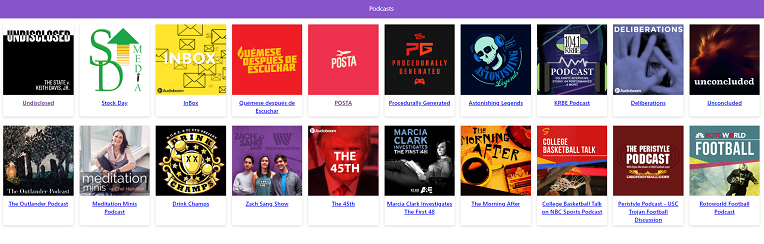

# App de Podcasts

App de Podcasts integrada con la API de AudioBoom hecho en Next.JS

 

## Correr la aplicacion

Requiere Node.JS 10

* `npm install` para instalar las dependencias.
* `npm run dev` para el entorno de desarrollo.
* `npm run build && npm start` para el entorno de producción.

## Licencia

MIT
